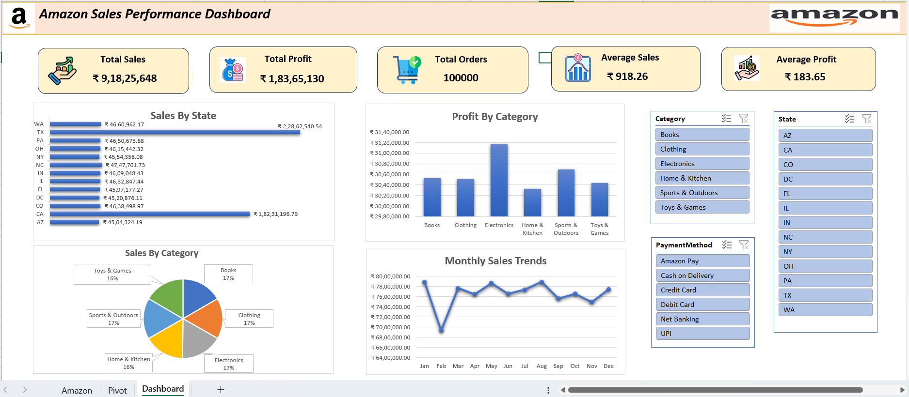

# 📊 Amazon Sales Performance Analysis

## 📌 Project Overview

This project analyzes Amazon India sales transaction data using **Microsoft Excel** and **Python** to evaluate overall business performance. The objective is to transform raw sales data into actionable business insights through data cleaning, KPI analysis, visualization, and interactive dashboards.

The project demonstrates an end-to-end data analytics workflow, including data preparation, exploratory data analysis (EDA), dashboard development, and business recommendations.

---

## 🎯 Business Problem

Amazon India's Sales and Operations team requires an analysis of historical sales transactions to understand business performance before planning the next quarter's strategy.

The analysis focuses on:

- Sales performance across states
- Product and category performance
- Customer contribution
- Payment preferences
- Monthly sales trends
- Business recommendations

---

## 🛠️ Tools & Technologies

- Microsoft Excel 2021
- Python
- Pandas
- Matplotlib
- Jupyter Notebook

---

## 📂 Project Structure

```
Amazon-Sales-Performance-Analysis/
│
├── Amazon_Sales.xlsx
├── Amazon_Sales_Analysis.ipynb
├── Amazon_Sales_Dashboard.xlsx
├── Dashboard.png
├── README.md
```

---

## 📈 Excel Dashboard

The interactive Excel dashboard includes:

### KPI Cards

- Total Sales
- Total Profit *(Estimated at 20% of Sales)*
- Total Orders
- Average Sales
- Average Profit

### Interactive Charts

- 📊 Sales by State
- 🥧 Sales by Category
- 📈 Monthly Sales Trend
- 📊 Top 10 Products by Sales

### Slicers

- State
- Category
- Payment Mode

---

## 🐍 Python Analysis

The Jupyter Notebook covers:

- Dataset Loading
- Dataset Overview
- Data Cleaning
- KPI Analysis
- Sales Analysis
- Customer Analysis
- Product Analysis
- Payment Mode Analysis
- Time-Based Analysis
- Multi-Level Analysis
- Data Visualization
- Business Recommendations

---

## 📊 Key Performance Indicators

- Total Sales
- Estimated Total Profit
- Total Orders
- Average Sales
- Average Profit
- Maximum Sales
- Minimum Sales

---

## 📉 Data Visualizations

The project includes the following visualizations:

- Bar Chart – Sales by State
- Horizontal Bar Chart – Top 10 Products by Sales
- Pie Chart – Sales by Category
- Line Chart – Monthly Sales Trend

---

## 📌 Business Insights

The analysis helps identify:

- Highest and lowest performing states
- Best-selling product categories
- Top 10 products based on sales
- Top 5 revenue-generating customers
- Most preferred payment methods
- Monthly sales trends
- Underperforming regions requiring attention

---

## 💡 Business Recommendations

- Increase inventory for high-performing products and categories.
- Launch targeted promotional campaigns in low-performing states.
- Reward loyal customers and encourage preferred payment methods through cashback and loyalty programs.

---

## 📁 Dataset

The dataset contains Amazon India sales transaction records, including:

- Order ID
- Order Date
- Customer Name
- Product Name
- Category
- Quantity
- Total Amount
- State
- Payment Method

> **Note:** The original dataset did not include a Profit column. For analytical purposes, Profit was estimated as **20% of Total Sales**.

---

## 🚀 Learning Outcomes

Through this project, I gained hands-on experience in:

- Data Cleaning
- Exploratory Data Analysis (EDA)
- Pivot Tables & Pivot Charts
- Dashboard Development
- KPI Reporting
- Data Visualization
- Business Intelligence
- Python Data Analysis using Pandas
- Business Recommendation Generation

---

## 📸 Dashboard Preview



## 📬 Connect With Me

If you found this project interesting, feel free to connect with me on LinkedIn or explore my other data analytics projects.
🔗 GitHub: https://github.com/Akanksha265

LinkedIn:https://www.linkedin.com/in/akanksha-kumari-1a0222289

⭐ If you like this project, consider giving it a star!
